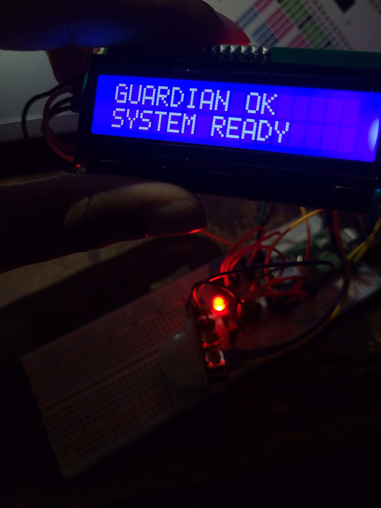

# 🛰️ Guardian Satellite - SATELIDOM ESTEISSY


> A small autonomous satellite system designed to monitor its environment, detect movement, and communicate important events.

**Guardian Satellite** is an embedded system based on the **Raspberry Pi Pico W** that combines environmental monitoring, security features, and wireless communication in a compact satellite-inspired device.

The project was created as a functional prototype where every component has a purpose: monitoring, detecting, displaying, and communicating.

---

# ✨ Features


## 🌡️ Environmental Monitoring

The satellite continuously monitors:

- Temperature
- Humidity

Data is displayed on an integrated LCD screen.

---

## 🔐 Guardian Mode



The security system can:

- Detect motion using a PIR sensor.
- Activate a visual alert.
- Activate an audible alarm.
- Send remote notifications (optional).

---

## 📡 Wireless Communication

The Raspberry Pi Pico W provides WiFi connectivity.

The system can:

- Receive remote commands.
- Send status information.
- Send motion alerts through Telegram.

⚠️ **Privacy Notice**

The Telegram version does not record audio, video, images, or personal information.

The system only sends:
- Device status.
- Sensor readings.
- Motion detection alerts.

Communication is only performed through the Telegram Bot API configured by the owner (For privacity).

---

# 🧠 System Overview

The Guardian Satellite works independently from WiFi.

Without internet:

✅ Motion detection works  
✅ Temperature monitoring works  
✅ Humidity monitoring works  
✅ LCD works  
✅ Alarm system works  

WiFi is only used for remote communication features.

---

# 🔧 Hardware

## Main Components

| Component | Function |
|-----------|----------|
| Raspberry Pi Pico W | Main controller and WiFi communication |
| PIR Motion Sensor | Motion detection |
| DHT11 Sensor | Temperature and humidity measurement |
| 16x2 LCD I2C | Information display |
| Passive Buzzer | Audible alarm |
| LED | Status indicator |
| 10kΩ Resistor | DHT11 pull-up resistor |

---

# 🔌 Connections

| Raspberry Pi Pico W | Component | Pin |
|---------------------|-----------|-----|
| GP0 | LCD I2C | SDA |
| GP1 | LCD I2C | SCL |
| VBUS | LCD I2C | VCC |
| GND | LCD I2C | GND |
| GP15 | PIR Sensor | OUT |
| VBUS | PIR Sensor | VCC |
| GND | PIR Sensor | GND |
| GP16 | LED | Positive |
| GND | LED | Negative |
| GP17 | Passive Buzzer | Signal |
| GND | Passive Buzzer | GND |
| GP18 | DHT11 | DATA |
| 3V3 OUT | DHT11 | VCC |
| GND | DHT11 | GND |

### DHT11 Configuration

A **10kΩ pull-up resistor** is connected between:

- VCC
- DATA

---

# 🔋 Portable Power System

The final version is designed to work without a computer.

Planned power system:

- 🔋 18650 Li-ion Battery
- 🔌 18650 Battery Holder with ON/OFF Switch
- ⚡ 18650 Battery Charger

Connection:

| Battery | Pico W |
|---------|--------|
| Positive (+) | VSYS |
| Negative (-) | GND |

---

# 💻 Software

## Programming

- MicroPython
- Thonny IDE

## Libraries

- DHT11 MicroPython Library
- LCD I2C Library
- urequests
- Telegram Bot API

---

# 📱 Telegram Integration

The Telegram version allows the satellite to communicate remotely.

Available commands:

```
/activar
```

Activates Guardian Mode.

```
/desactivar
```

Disables Guardian Mode.

```
/status
```

Returns:

- System status
- Temperature
- Humidity
- Current mode

---

# 📦 Project Structure

```
Guardian-Satellite/

├── README.md
├── BOM.md
├── WIRING.md
│
├── firmware/
│   └── main.py
│
├── images/
│   ├── satellite.png
│   └── 
```

---

# 🚧 Current Status

## Completed ✅

- [x] Raspberry Pi Pico W integration
- [x] PIR motion detection
- [x] Temperature monitoring
- [x] Humidity monitoring
- [x] LCD interface
- [x] LED status system
- [x] Audible alarm
- [x] Telegram communication
- [x] Remote commands

## Planned 🔜

- [ ] 3D printed satellite enclosure
- [ ] Portable battery system
- [ ] Final soldered version
- [ ] Improved power management

---

# 🌌 Vision

The Guardian Satellite is more than a sensor box.

It is a small autonomous monitoring system designed to demonstrate how embedded electronics, programming, communication, and engineering can work together in a compact device.

A miniature satellite that watches over its environment. 🛰️

---

# 👨‍🚀 Author

Created by **Andrea Esteissy Rosario Martinez*

Project developed with:
- Raspberry Pi Pico W
- MicroPython
- Electronics
- Curiosity 🚀
