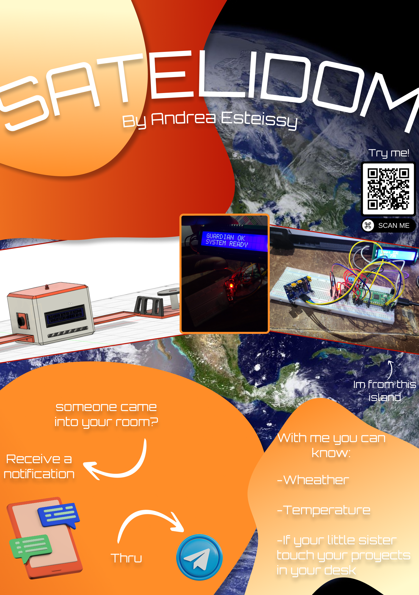
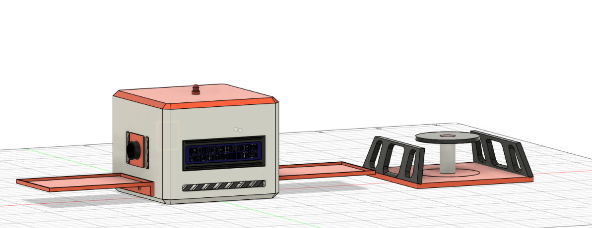
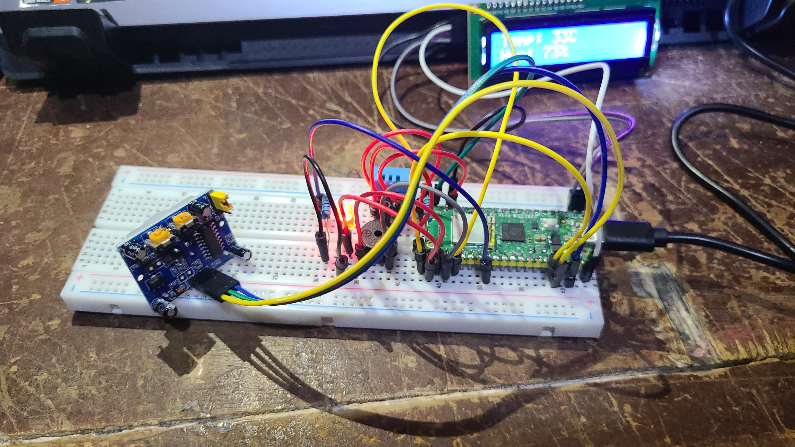
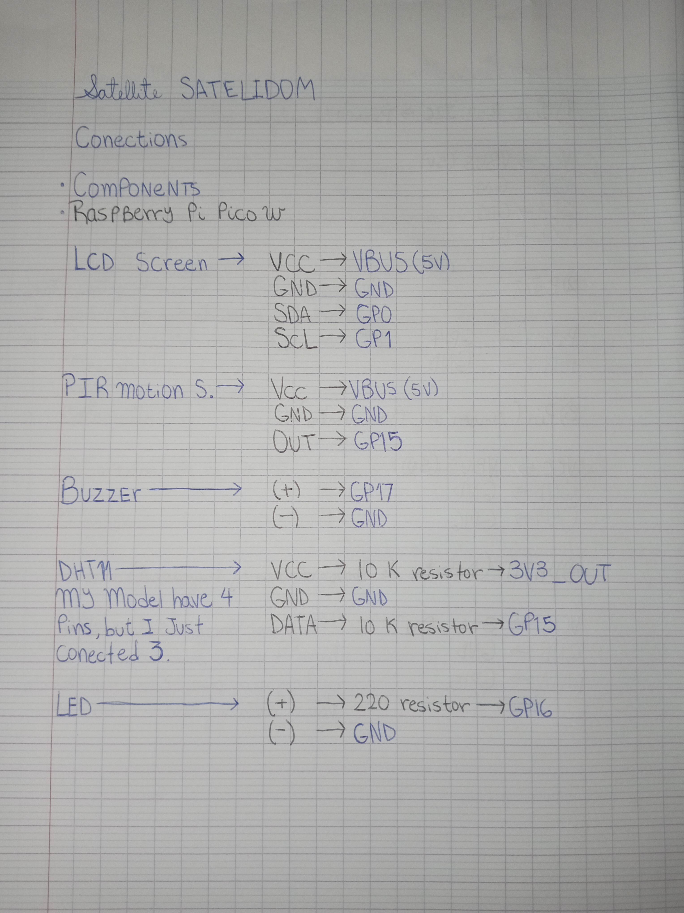

# 🛰️ SATELIDOM

---

> A cute, compact, square-shaped satellite designed to monitor temperature, humidity, and movement, and alert me whenever someone enters my room while I'm away from my desk.

**SATELIDOM** is a satellite-inspired project powered by a Raspberry Pi Pico W.

---

# ✨ Features

**The device can monitor:**

🌡️ -Temperature

💧 -Humidity

🔐 -Motion (Technically it detects presence using a PIR sensor, but "motion detection" is easier to understand.)

---

It also has several features that can be controlled from a phone:

* Enable or disable motion detection ( useful when I'm at my desk and don't want to hear the *beep beep*)
* Check the current temperature and humidity remotely.

All of this is possible through a Telegram bot.

I can't make my bot public because it's configured specifically for **MY** satellite and contains sensitive information, but you can easily create your own Telegram bot if you'd like to build this project.

If you don't want to spend time setting that up, don't worry! The version available in this GitHub repository is a fully functional **offline version**, so it works perfectly even without WiFi.

---

# Directory:

**/CAD** 
-Satelite.f3z 
-Satelite.step

**/firmware**
-main.py

**/Images**
-(There are my github images)

**/Production**
-Base.stl
-Cuerpo.stl
-Panel1.stl
-Panel2.stl
-Tapa.stl
-main.py

  ---

# Wiring

Jumpers, jumpers, JUST JUMPERS AND MORE JUMPERS!

---

I spent a long time working on this satellite, even before I started building it. I hope you enjoy it as much as I enjoyed creating it.

# Created by Andrea Esteissy Rosario Martinez

Built with:

* Raspberry Pi Pico W
* MicroPython
* Electronics
* Curiosity 🚀

**PD:** I put too much effort in this README cause I wanted that look *Profeshonal* sooooooooooo, pls READ IT! thanks for watching ;) 
